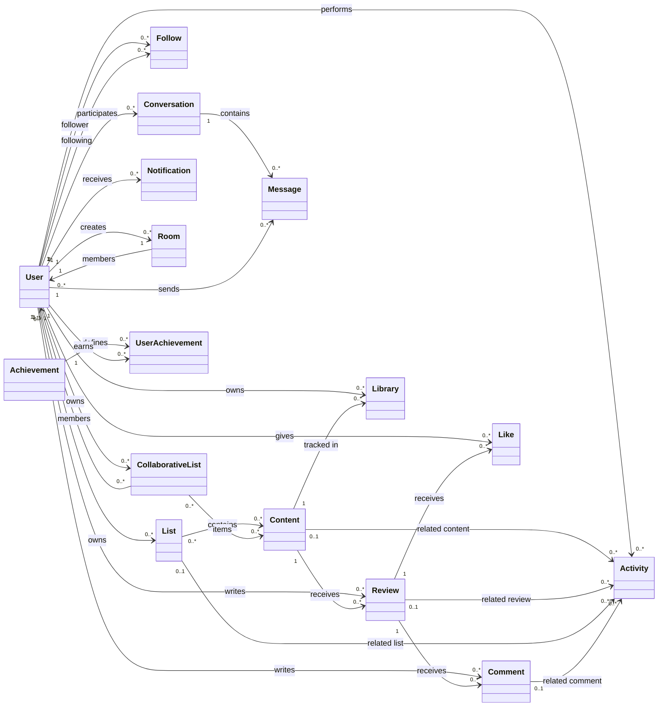
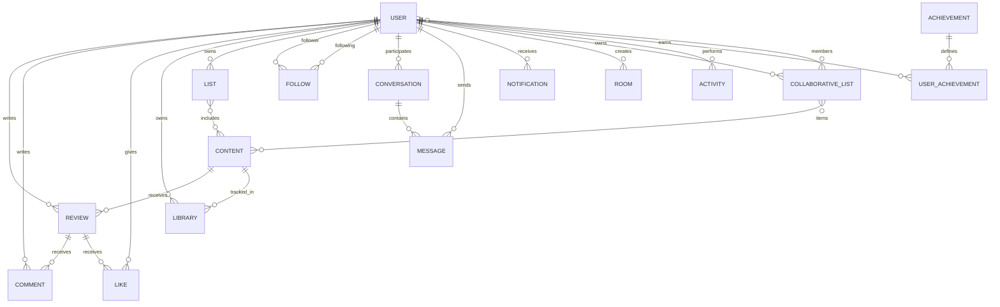

# Documentation technique SUPCONTENT

Ce document résume le modèle métier réel de l'application à partir des modèles MongoDB présents dans le backend.

## 1. Schéma UML



## 2. Schéma de base de données



### 2.1 Collections principales

| Collection | Champs clés | Relations principales | Index / contrainte |
| --- | --- | --- | --- |
| `User` | `username`, `displayName`, `email`, `password`, `googleId`, `githubId`, `avatar`, `bio`, `website`, `isVerified`, `isAdmin`, `isBanned`, `theme`, `language`, `emailNotifications`, `pushNotifications` | auteur de critiques, commentaires, likes, listes, messages, notifications, rooms, follows, activités, achievements | `username` unique, `email` unique, `googleId` unique sparse, `githubId` unique sparse, texte sur `username` et `displayName` |
| `Content` | `externalId`, `slug`, `title`, `description`, `released`, `backgroundImage`, `metacritic`, `rating`, `ratingsCount`, `playtime`, `genres`, `platforms`, `developers`, `publishers`, `esrbRating`, `website`, `averageUserRating`, `totalUserRatings`, `totalReviews`, `cachedAt` | référencé par `Review`, `Library`, `List`, `CollaborativeList`, `Activity` | `externalId` unique, `slug` unique, texte sur `title` et `description`, index sur `genres` et `released` |
| `Review` | `user`, `content`, `rating`, `text`, `spoiler`, `likes`, `isReported`, `reportReason`, `isFeatured` | appartient à un `User` et un `Content`; reçoit `Comment`, `Like`, `Activity` | unique sur `(user, content)`, index sur `(content, createdAt)`, index sur `isFeatured` |
| `Comment` | `user`, `review`, `text`, `parentComment` | appartient à un `User` et un `Review`; auto-référence possible via `parentComment` | aucun index explicite |
| `Like` | `user`, `review` | appartient à un `User` et un `Review` | unique sur `(user, review)` |
| `Library` | `user`, `content`, `status`, `rating`, `hoursPlayed`, `notes` | relie un `User` à un `Content` pour le suivi personnel | unique sur `(user, content)`, index sur `(user, status)` |
| `List` | `user`, `name`, `description`, `isPublic`, `items` | appartient à un `User`; contient plusieurs `Content` | aucun index explicite |
| `Follow` | `follower`, `following` | relation utilisateur à utilisateur | unique sur `(follower, following)` |
| `Conversation` | `participants`, `lastMessage`, `lastMessageAt` | conversation privée entre exactement 2 `User`; référence un `Message` dernier message | index sur `(participants, lastMessageAt)` |
| `Message` | `conversation`, `sender`, `content`, `messageType`, `audioUrl`, `audioMimeType`, `audioDuration`, `read`, `readBy`, `likedBy` | appartient à une `Conversation`; envoyé par un `User`; peut être vocal | index sur `(conversation, createdAt)`, `(conversation, read)`, `(conversation, readBy.user)`, `(conversation, likedBy.user)` |
| `Notification` | `user`, `type`, `from`, `reference`, `message`, `isRead` | notifie un `User` à partir d’un autre `User`; référence optionnelle vers une ressource métier | aucun index explicite |
| `Room` | `name`, `description`, `avatar`, `visibility`, `rules`, `creator`, `members`, `pendingRequests`, `bannedUsers`, `isActive` | salon créé par un `User`; contient des membres embarqués, des demandes en attente et des bannis | aucun index explicite |
| `CollaborativeList` | `name`, `description`, `owner`, `members`, `items`, `visibility`, `inviteCode`, `tags` | liste collaborative possédée par un `User`; membres et items embarqués | `inviteCode` unique sparse, index sur `owner`, `members.user`, `visibility` |
| `Activity` | `user`, `type`, `content`, `review`, `list`, `targetUser`, `comment`, `metadata` | journal d’activité relié à plusieurs entités suivant le type | index sur `(user, createdAt)` et `createdAt` |
| `Achievement` | `name`, `description`, `icon`, `category`, `condition`, `rarity`, `isSecret`, `points` | définition d’un badge / succès | `name` unique |
| `UserAchievement` | `user`, `achievement`, `progress`, `isUnlocked`, `unlockedAt` | état de progression d’un `User` sur un `Achievement` | unique sur `(user, achievement)`, index sur `(user, isUnlocked)` |

### 2.2 Sous-documents embarqués

Ces structures ne sont pas des collections séparées MongoDB, mais des tableaux embarqués dans les documents parents.

- `Room.members` contient `{ user, role, joinedAt }`
- `Room.pendingRequests` contient des identifiants `User`
- `Room.bannedUsers` contient `{ user, bannedBy, bannedUntil, reason }`
- `CollaborativeList.members` contient `{ user, role, addedAt }`
- `CollaborativeList.items` contient `{ content, addedBy, addedAt, note }`
- `Message.readBy` contient `{ user, readAt }`
- `Message.likedBy` contient `{ user, likedAt }`
- `Achievement.condition` contient `{ type, target, value }`

## 3. Lecture rapide du modèle métier

- Le cœur fonctionnel repose sur `User`, `Content`, `Review`, `Library` et `Message`.
- Les interactions sociales sont gérées par `Follow`, `Comment`, `Like`, `Notification`, `Activity` et `Conversation`.
- Les espaces collaboratifs passent par `Room` et `CollaborativeList`.
- La gamification est portée par `Achievement` et `UserAchievement`.
- `Content` joue le rôle de cache local des jeux issus de l’API externe, avec enrichissement statistique côté SUPCONTENT.

## 4. Remarque d’architecture

Le schéma est orienté MongoDB/Mongoose. Certaines relations UML sont logiques et non matérialisées comme des tables SQL séparées. Pour cette raison, les cardinalités doivent être lues comme des dépendances de documents et non comme des clés étrangères strictes.

## 5. Prérequis:

- Node.js >= 18.0.0 
- npm >= 9.0.0
- Compte RAWG API (gratuit) : https://rawg.io/apidocs 
  
## 6. Cloner le projet

Dans votre terminal et le dossier souhaité effectuez cette commande (si le projet n’est pas déjà sur votre pc).
````bash
git clone https://github.com/Abdoul12Rahim/SUPCONTENT.git 
cd supcontent
````

## 7. Lancement et configuration du Frontend Web et Mobile

Pour lancer le projet et configurer le frontend mobile rendez-vous dans le fichier `DEMARRAGE_RAPIDE.md`

## 8. Déploiement du projet

Local:
- API backend : http://localhost:5000/api
- WebSocket / Socket.IO : http://localhost:5000/

Prod;
- API backend : https://supcontent-production.up.railway.app/api
- WebSocket : https://supcontent-production.up.railway.app/

## 8. Justification des choix technologiques

Frontend Web:
- `React avec Vite `: React a été choisi pour son architecture basée sur des composants réutilisables, ce qui fluidifie le développement de l'interface du réseau social. De plus, Vite offre un serveur de développement instantané grâce aux modules ES natifs et des builds de production optimisés.

Backend:
- `Node.js`: Node.js est idéal pour les applications réseau nécessitant une forte scalabilité ce qui est indispensable pour notre système de notifications en temps réel. Utiliser Express.js nous a permis de mettre en place une API REST robuste, légère et flexible de manière très rapide

Base de données:
- `MongoDB`: MongoDB fournit une base de données NoSQL orientée documents. Contrairement à une base SQL rigide, MongoDB permet de stocker des objets JSON flexibles. C'est parfait pour notre projet où les fiches de jeux vidéo (récupérées via l'API RAWG) possèdent des structures de données variables selon les catégories. Cela nous évite des jointures complexes et accélère le temps de réponse de l'API.

Mobile:
- `expo`: Expo a été choisi comme surcouche à React pour sa capacité à accélérer le cycle de développement mobile. Contrairement à une installation React classique, Expo élimine le besoin de configurer les outils natifs complexes (Xcode et Android Studio) en début de projet. Il a permis à notre équipe de tester l'application en temps réel, que nos téléphones soient en android ou en IOS.